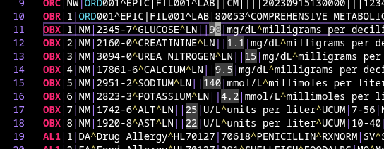
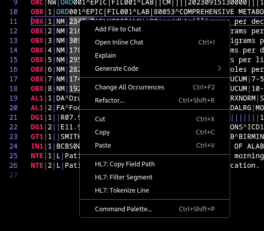

# HL7 language support for Visual Studio Code

  [](https://marketplace.visualstudio.com/items?itemName=pbrooks.hl7)
  [](https://marketplace.visualstudio.com/items?itemName=pbrooks.hl7)
  [](https://marketplace.visualstudio.com/items?itemName=pbrooks.hl7)

Syntax highlighting, field tokenization, and hover info for HL7 v2.x messages in Visual Studio Code.

Field definitions and hover info use the HL7 v2.5.1 and v2.7.1 data dictionaries (auto-detected from MSH-12). Messages from other v2.x versions will still get syntax highlighting, but field names and datatypes may not match exactly.

## Features
### Syntax coloring
* Segments and field separators are highlighted for easy interpretation.


### Field Hover Info
* Hover over any field in an HL7 message to see its name, datatype, and component breakdown.
* For fields with multiple components (separated by `^`), all components are listed with the one under the cursor highlighted.


### Field Level Highlighting
  * Place your cursor on any segment name (e.g., `OBX`) to highlight every occurrence
  of that segment across the message.
  * Place your cursor on a field or component to highlight the same field path on all
  matching segment lines — useful for comparing values like `OBX-5` across multiple
  observations or `PID-5.2` (Given Name) across patient records.



### Tokenize Line Command
* Move the cursor to a line that you wish to tokenize.
* F1 -> HL7: Tokenize Line
* Line will be split into fields with the ordinal and definition.
* Output opens in a dedicated tab (starting from the top) that is reused on subsequent tokenize actions.


### Auto-Tokenize Mode
* F1 -> HL7: Toggle Auto-Tokenize
* When enabled, the current line is automatically tokenized as you move the cursor through the file — no need to re-run the command for each line.
* A status bar indicator shows when Auto-Tokenize is active. Click it to toggle off.


### Filter Segment Command
* Move the cursor to a line that you wish to filter.
* F1 -> HL7: Filter Segment
* A new file will be created containing only segments that match the current line.


### Copy Field Path
* Place the cursor on any field or component in an HL7 message.
* Right-click -> HL7: Copy Field Path (or F1 -> HL7: Copy Field Path)
* Copies the HL7 path (e.g. `PID-3.1` or `PID-1`) to the clipboard.

### MLLP Send & Receive
* **Send Message**: F1 -> HL7: Send Message — sends the current file (or selection) to an MLLP endpoint and displays the ACK response.
* **Start Listener**: F1 -> HL7: Start MLLP Listener — starts a local MLLP server that receives messages and opens each one in a new editor tab.
* **Stop Listener**: F1 -> HL7: Stop MLLP Listener — stops the running listener.
* Default host and port are configurable via `hl7.mllp.host` and `hl7.mllp.port` settings.

### Segment Count & Version Status Bar
* The status bar displays the detected HL7 version and a count of segments in the current file (e.g. `HL7 v2.7.1 | 12 segments (5 types)`).
* Hover over it to see a breakdown by segment type.

### Context Menu
* Right-click in an HL7 file to access **Filter Segment**, **Tokenize Line**, and **Copy Field Path** directly from the context menu.



## Commands

| Command                       | Description                                                  |
| ----------------------------- | ------------------------------------------------------------ |
| `HL7: Tokenize Line`         | Split the current line into fields with ordinals and definitions |
| `HL7: Toggle Auto-Tokenize`  | Automatically tokenize each line as the cursor moves         |
| `HL7: Filter Segment`        | Create a new file containing only matching segment types     |
| `HL7: Copy Field Path`       | Copy the HL7 field path at the cursor to the clipboard       |
| `HL7: Send Message`          | Send the current message to an MLLP endpoint                 |
| `HL7: Start MLLP Listener`   | Start a local MLLP listener to receive messages              |
| `HL7: Stop MLLP Listener`    | Stop the running MLLP listener                               |

## Installation
### Visual Studio Code
Search for "HL7" in the Extensions sidebar, or press `F1` and enter `ext install pbrooks.hl7`.

### Manual Installation
Clone the [GitHub repository](https://github.com/pagebrooks/vscode-hl7) under your local extensions folder:
* Windows: `%USERPROFILE%\.vscode\extensions`
* Mac / Linux: `$HOME/.vscode/extensions`

Then initialize the repository submodules:
```
git submodule init
git submodule update
```

## Issues / Feature requests
You can submit your issues and feature requests on the GitHub [issues page](https://github.com/pagebrooks/vscode-hl7/issues).

## Support This Project
If this extension is useful to you, consider [sponsoring its development](https://github.com/sponsors/pagebrooks).

## What is HL7?
[HL7](https://www.hl7.org/) (Health Level Seven) is a set of standards for exchanging clinical and administrative data between healthcare systems. The v2.x messaging format uses pipe-delimited segments (e.g. `MSH`, `PID`, `OBR`) and is one of the most widely deployed healthcare integration standards in the world.

## More information
* [vscode-hl7 on the Visual Studio Marketplace](https://marketplace.visualstudio.com/items?itemName=pbrooks.hl7)
* [Changelog](CHANGELOG.md)