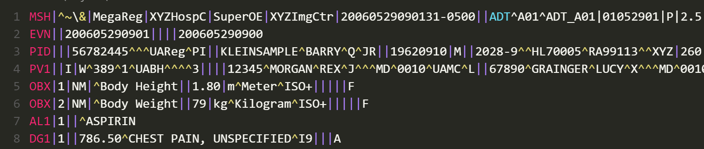
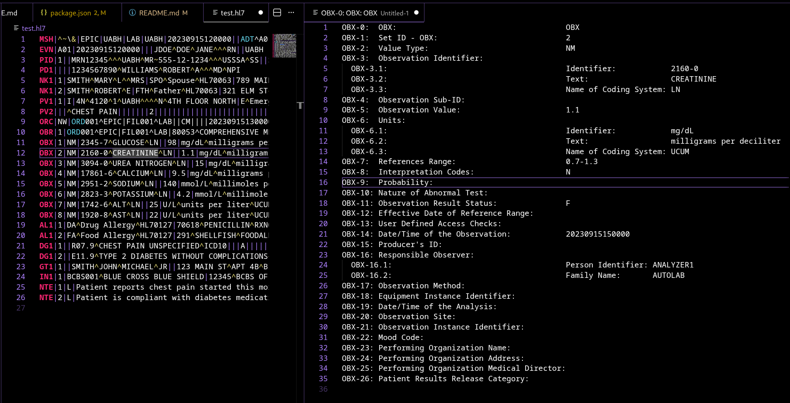
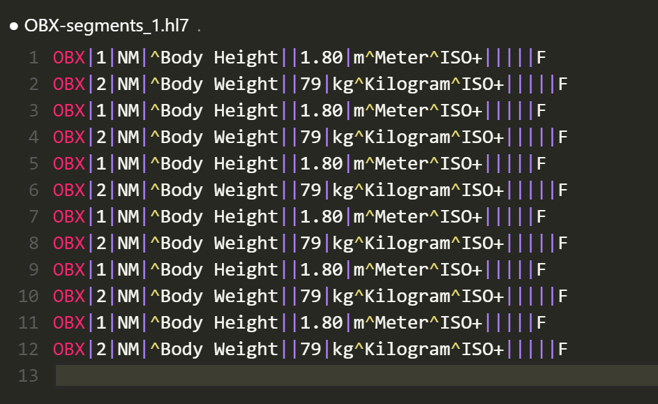

# HL7 language support for Visual Studio Code

## Features
### Syntax coloring
* Segments and field separators are highlighted for easy interpretation.



### Tokenize Line Command
* Move the cursor to a line that you wish to tokenize.
* F1 -> HL7: Tokenize Line
* Line will be split into fields with the ordinal and definition



### Filter Segment Command
* Move the cursor to a line that you wish to filter.
* F1 -> HL7: Filter Segment
* A new file will be created containing only segments that match the current line.




## Installation
### Visual Studio Code 
Press `F1` and enter the `ext install hl7` command.

### Manual Installation
Clone the [GitHub repository](https://github.com/pagebrooks/vscode-hl7) under your local extensions folder:
* Windows: `%USERPROFILE%\.vscode\extensions`
* Mac / Linux: `$HOME/.vscode/extensions`

Important: Make sure you run the following commands to initialize the repository submodules:
```
$> git submodule init
$> git submodule update
```

## Issues / Feature requests
You can submit your issues and feature requests on the GitHub [issues page](https://github.com/pagebrooks/vscode-hl7/issues).

## More information
* [vscode-hl7 on the Visual Studio Marketplace](https://marketplace.visualstudio.com/items/pbrooks.hl7)